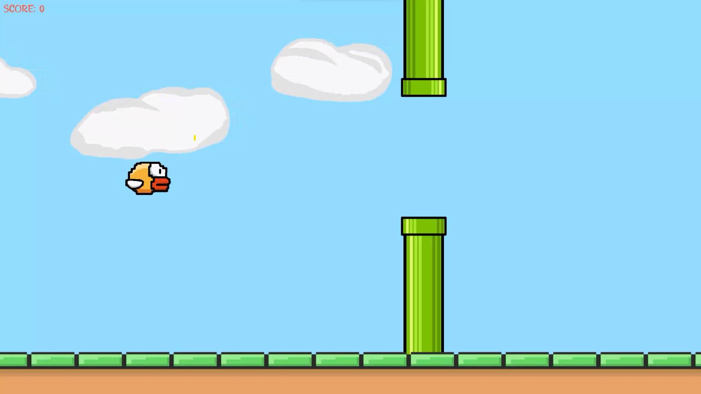
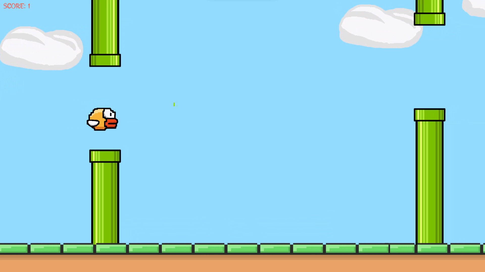
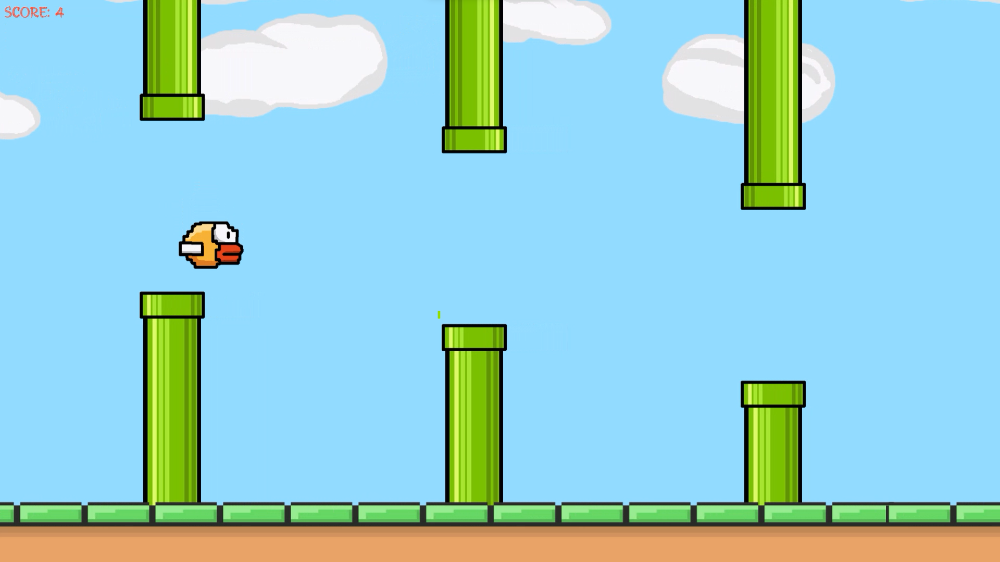
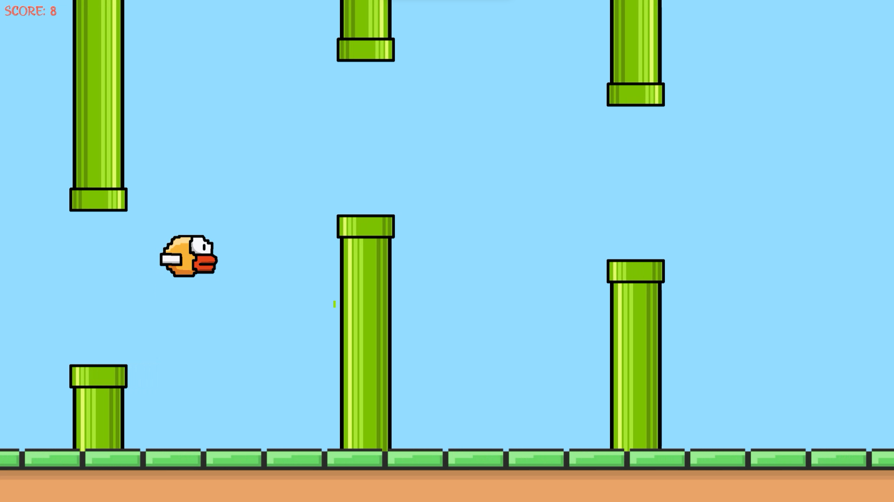
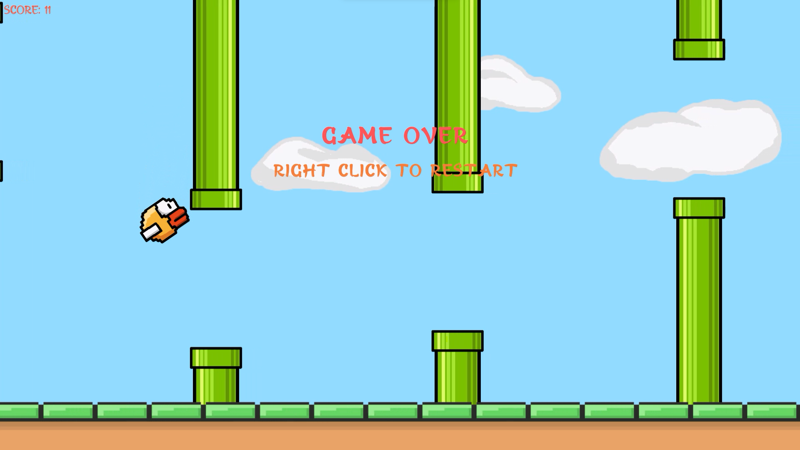

# Flappy Bird

### Introduction
    Flappy bird is a game where a player controls a bird by tapping the screen to make it fly through gaps in
    pipes, avoiding collisions. The goal is to score as many points as possible by flying the bird through as
    many pipes as possible without crashing.

### Features
    - Intuitive Controls:
        - Easy-to-master tap controls for a seamless gaming experience.

    - Endless Gameplay:
        - Experience an infinite level design for endless fun and challenges.

    - Dynamic Obstacle Generation:
        - Randomized pipe placements for unpredictable and exciting gameplay.

    - Visual Variety:
        - Enjoy vibrant graphics and a visually appealing design.
        
    - Responsive UI:
        - User-friendly interface ensuring smooth navigation and accessibility.
        
    - Scoring tracking System.
    
### Screenshots

   
   
   
   
   

   
### Implementation and Game Design
#### Implementation
##### Scripts
    - BirdController: Controls a bird's jumping behavior on mouse click, triggering a flap animation, and
             handles collisions to stop movement and invoke game-related events.
    
    - ColumnsPool: manages the pooling and repositioning of columns in a 2D game, ensuring a continuous column 
             spawn rate and handling their dynamic repositioning during gameplay.
                  
    - ColumnsController: Triggers scoring and sound effects when a bird enters the trigger zone of a column.
    
    - GameController: Manages the game flow, controlling the start, pause, and game over states. It handles 
             scoring, restarting the game on mouse click after a game over, and toggling between pause and play 
             states with specific input controls.
    
    - LobbyController: Handles a game lobby with start and quit buttons, triggering sound effects and actions 
             such as loading the next scene or quitting the application.

    - RepeatingGround: Manages a repeating ground, repositioning it when it goes beyond a certain horizontal 
             length to create a continuous scrolling effect.
             
    - ScrollingObjectController: Controls the scrolling behavior of an object, adjusting its velocity based on 
             the game's scroll speed. The object stops scrolling when the game is over.

    - SoundManager: manages sound effects, providing a singleton instance to play various audio clips. It 
             includes functionality to play specific sounds and ensures that the sound manager persists across scenes.
             
 #### Game Design
     - Designed strategic level using provided assets.
    
### Gameplay Demonstration
    - For a visual demonstration of the gameplay, watch video on YouTube:
 [Youtube video link](https://youtu.be/AiR1l4ESMho)

### Play the Game
    - To experience the game firsthand, play it directly by following this playable link:
[Play in browser(WebGl)](https://rahul-pargi.itch.io/flappy-bird)
 
